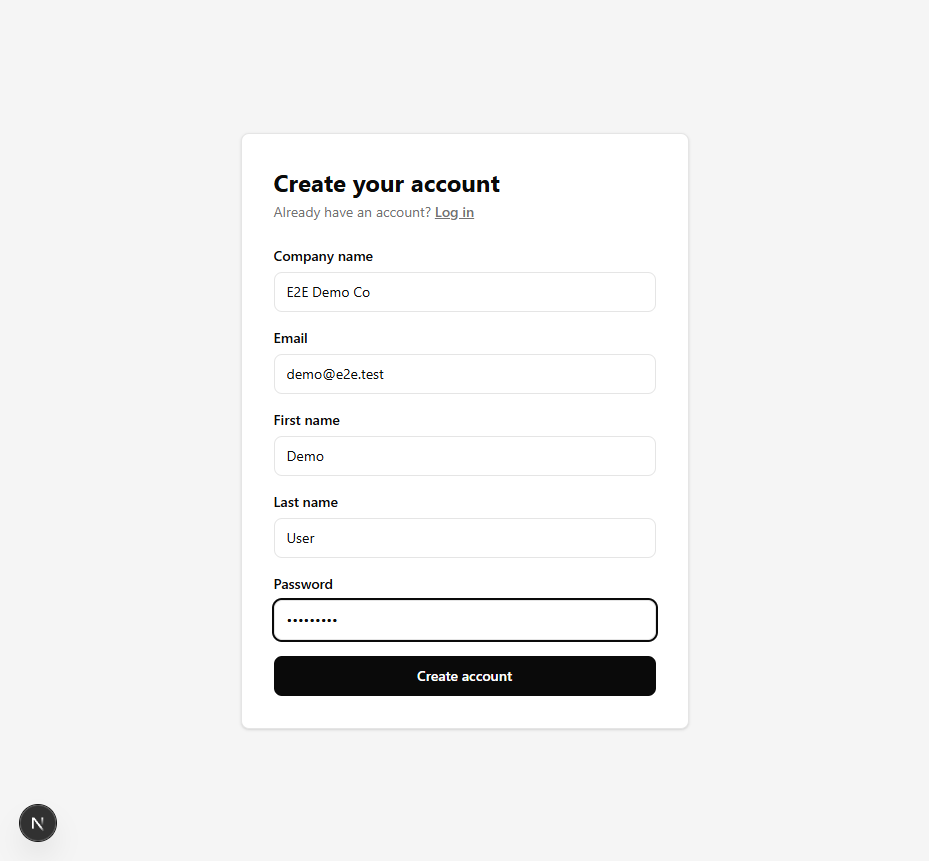
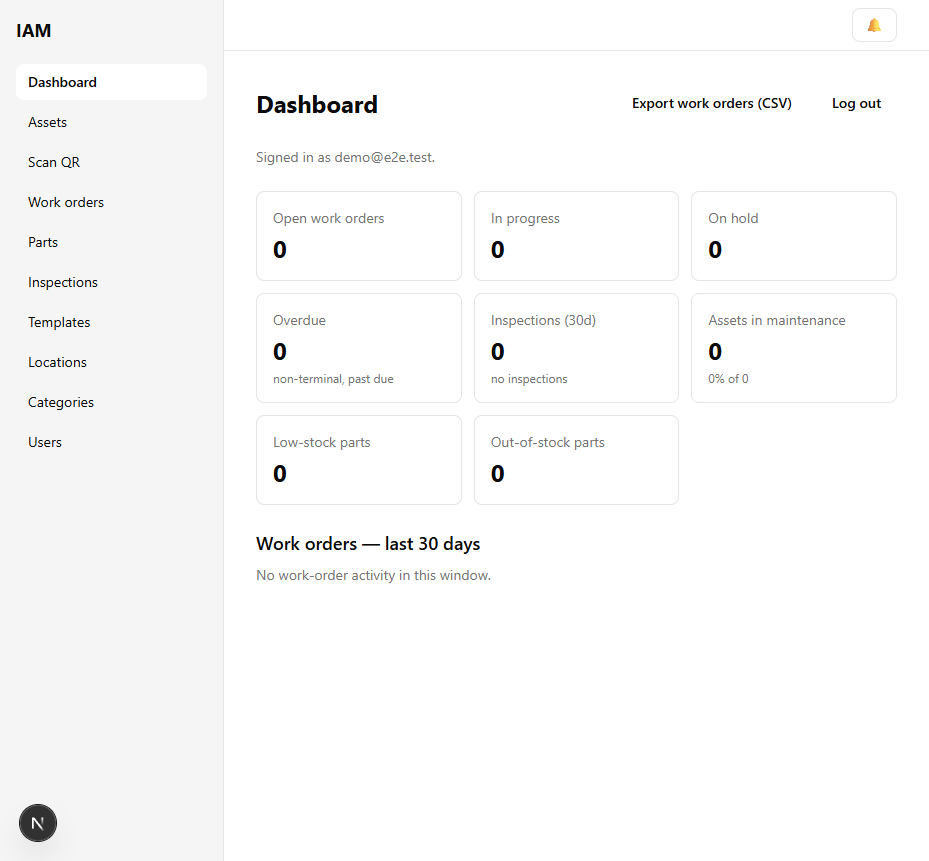
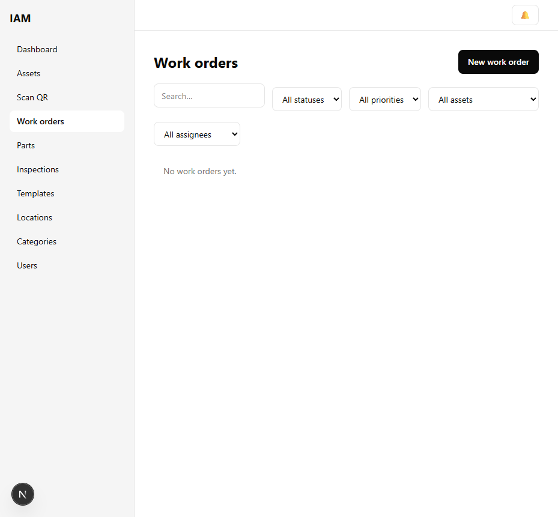
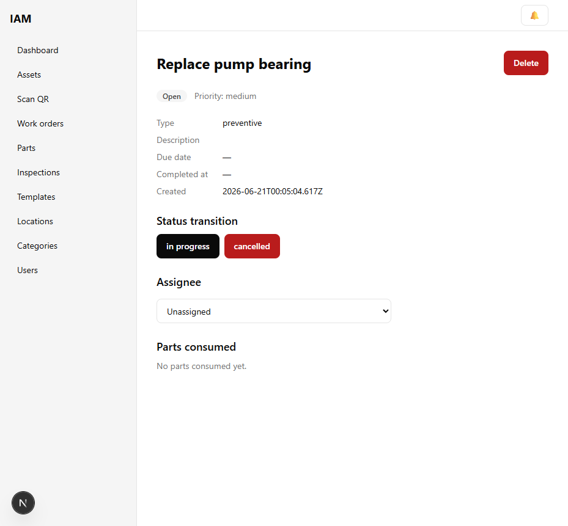

# Industrial Asset & Maintenance SaaS

[](https://github.com/onesixeight/industrial-asset-maintenance-saas/actions/workflows/ci.yml)

B2B SaaS for tracking industrial equipment, scheduling maintenance, managing
spare-parts inventory, and running QR-based inspections. Multi-tenant,
role-based (admin / manager / technician / viewer), JWT-authenticated with
refresh-token rotation. Portfolio project.

> **Status:** Phases 0–10 complete. See [`docs/progress.md`](./docs/progress.md).

## Quick start

```bash
git clone https://github.com/onesixeight/industrial-asset-maintenance-saas.git
cd industrial-asset-maintenance-saas
cp .env.example .env
docker compose up -d        # postgres:16 + redis:7
pnpm install
pnpm --filter @iam/shared build   # required before first api/web dev run
pnpm --filter @iam/api exec prisma migrate deploy
pnpm --filter @iam/api db:seed    # demo company + assets + WOs + parts
pnpm dev                          # web :3000, api :4000
```

Open http://localhost:3000 and log in with the demo account:

| Role | Email | Password |
|---|---|---|
| Admin | `demo@acme.test` | `Password1` |
| Manager | `manager@acme.test` | `Password1` |
| Technician | `tech@acme.test` | `Password1` |

The seed is idempotent — safe to re-run. API health check: http://localhost:4000/health · Swagger: http://localhost:4000/docs

## Screenshots

| Registration | Dashboard |
|---|---|
|  |  |

| Work orders list | Work order detail |
|---|---|
|  |  |

## Stack

- **Web:** Next.js 16 (React 19, Turbopack, App Router), Tailwind CSS v4, TanStack Query v5, React Hook Form, Zustand
- **API:** NestJS 11 (Express 5), Prisma 7 (driver adapter), Zod-validation pipe, Swagger
- **Data:** PostgreSQL 16, Redis 7 (refresh-token denylist + throttler storage)
- **Auth:** JWT (`jti`) access (in-memory) + refresh (httpOnly cookie, rotation), `@nestjs/throttler`, role guard
- **Tooling:** pnpm workspaces + Turborepo, Vitest (unit/integration), Playwright (browser E2E), GitHub Actions, Docker

## Scripts

| Command | Description |
|---|---|
| `pnpm dev` | Start web + api in dev mode (Turborepo) |
| `pnpm build` | Production build of all workspaces |
| `pnpm lint` / `pnpm typecheck` | ESLint / `tsc --noEmit` across all workspaces |
| `pnpm test` | Vitest unit + integration (257 tests) |
| `pnpm --filter @iam/web e2e` | Playwright browser E2E (5 critical paths) |
| `pnpm --filter @iam/api db:seed` | Seed the demo dataset |
| `pnpm format` | Prettier write |

## Architecture

```
apps/
  web/        Next.js 16 — App Router, (auth)/(dashboard) route groups, server-component guard
  api/        NestJS 11 — modules: auth, users, locations, categories, assets,
              work-orders, inspections, parts, dashboard, reports, notifications
packages/
  shared/     Zod schemas = single source of truth for types (api DTOs + web forms)
```

**Multi-tenancy:** every domain query is scoped by `companyId` from the JWT. Cross-tenant reads return 404 (no existence leak).

**Auth model (ADR 0002):** hybrid — signed JWTs verified statelessly, plus a Redis denylist keyed by `jti` for refresh-token revocation. Access token in memory (Zustand), refresh token in an httpOnly cookie, rotation on every refresh.

**RBAC:** admin / manager / technician / viewer. Class-level `RolesGuard` for simple role gates; service-layer ownership checks where the rule is "technician if assigned" (work-order transitions, parts consumption).

**Critical-path tests in-phase:** per the execution spec, every critical path (registration, WO status transitions, inspection `passed` logic, transactional parts consumption, low-stock trigger) has passing tests written in the same phase that ships it — not deferred.

## Deployment

The repo ships ready-to-use deployment configs; you execute the deploy against your own cloud accounts (see [ADR 0008](./docs/adr/0008-deployment-config-artifacts.md) for why configs over live deploys).

### API + Postgres — Render

1. Push this branch to `main` (Render reads `render.yaml` from the repo).
2. In Render → New → Blueprint → select this repo. The blueprint provisions:
   - a `web` service (`iam-api`) running `pnpm --filter @iam/api start`, health check `/health`
   - a managed Postgres (`iam-postgres`)
3. In the `iam-api` service env, set the `sync: false` vars:
   - `REDIS_URL` → your Upstash Redis endpoint
   - `CORS_ORIGIN`, `PUBLIC_SCAN_BASE` → your deployed Vercel web URL
4. Migrations + seed run as part of the build command. First deploy may take a few minutes.

### Redis — Upstash

Create a free Upstash Redis instance, copy its endpoint (`rediss://...`), and set it as `REDIS_URL` in the Render api env.

### Web — Vercel

1. Import the repo in Vercel. `vercel.json` sets the build (`pnpm --filter @iam/shared build && pnpm --filter @iam/web build`) and the `/api/* → API_ORIGIN` rewrite.
2. Set env vars in the Vercel project:
   - `API_ORIGIN` → your deployed Render api URL (e.g. `https://iam-api.onrender.com`)
   - `NEXT_PUBLIC_API_URL` → `/api`
3. Deploy. The rewrite proxies browser `/api/*` calls to the api, keeping the refresh cookie same-origin.

### R2

Not used — per [ADR 0005](./docs/adr/0005-defer-bullmq-r2.md) the CSV report export is generated synchronously on request.

## Documentation

- **Product & technical plan:** [`PROJECT_PLAN.md`](./PROJECT_PLAN.md)
- **Execution process (phases, gates):** [`docs/superpowers/specs/2026-06-17-execution-process-design.md`](./docs/superpowers/specs/2026-06-17-execution-process-design.md)
- **Progress tracker:** [`docs/progress.md`](./docs/progress.md)
- **Development log (per-phase):** [`DEVELOPMENT_LOG.md`](./DEVELOPMENT_LOG.md)

### Architecture Decision Records

- [ADR 0001 — Technology stack versions (June 2026)](./docs/adr/0001-tech-stack-versions-2026.md)
- [ADR 0002 — Refresh rotation + httpOnly cookie](./docs/adr/0002-refresh-rotation-httponly-cookie.md)
- [ADR 0003 — Temp password + force-change](./docs/adr/0003-temp-password-force-change.md)
- [ADR 0004 — Bounded low-stock trigger](./docs/adr/0004-low-stock-trigger.md)
- [ADR 0005 — Defer BullMQ + R2 (synchronous reports)](./docs/adr/0005-defer-bullmq-r2.md)
- [ADR 0006 — 60s polling over WebSockets](./docs/adr/0006-polling-over-websockets.md)
- [ADR 0007 — Playwright authenticates via real login](./docs/adr/0007-playwright-real-login.md)
- [ADR 0008 — Deployment config artifacts](./docs/adr/0008-deployment-config-artifacts.md)

## Testing

- **Vitest** (257 tests) — unit + integration across `api` / `shared` / `web`. API integration tests run on a real PostgreSQL test container (`:5433`).
- **Playwright** (5 specs) — browser E2E against a live stack: register→dashboard, login→silent-refresh, WO lifecycle, parts-consume→notification (Phase 6→8 loop), RBAC-403.
- **CI** — `pnpm lint && typecheck && test && build` on every push; a dedicated `playwright` job with artifact upload on failure.
